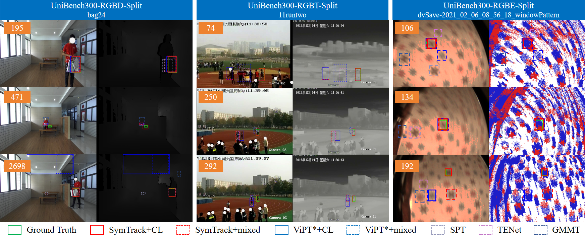
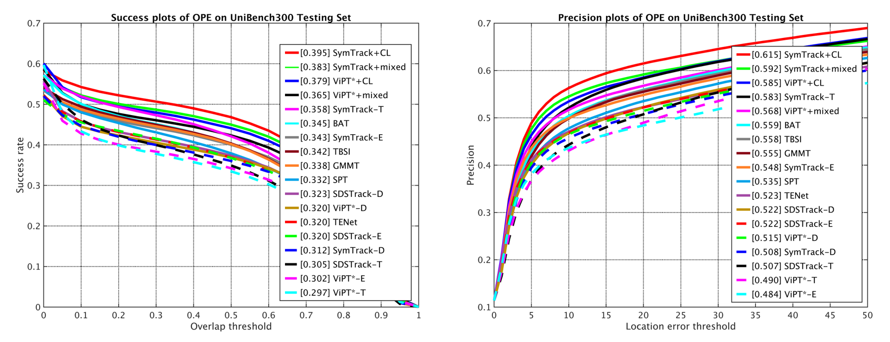

# UniBench300

Limited by the file size, the whole UniBench300 can not be shared here.
Thus only sevral samples are displayed here.



```bash
UniBench300 contains RGBT, RGBD, and RGBE data simultaneously.
```


# Benchmark-Toolkit

Download the UniBench300* files to maintain the toolkit for UniBench300.

UniBench_Toolkit.zip is the main file and create 'tracking_results' after unziped.
Then unzip other files into this dictory.



```bash
Toolkit: [URL](https://pan.baidu.com/s/1zpyymZvaSWj6T8OmeBFLPw) CODE:TZYD 
Dataset: CODE:TZYD [URL](https://pan.baidu.com/s/1zpyymZvaSWj6T8OmeBFLPw)
```

# Results

```bash
To make this work more convincing, the result files of original, mixed, and CL-boosted versions on LasHeR,
DepthTrack, and VisEvent are provided. (SymTrack*)
```

# Code

|  Stage|Initialised| Involved Data | Saved Model|
|--|--|--|--|
|  1|Random| VisEvent |SymTrack-e.pth.tar|
|  2| SymTrack-e.pth.tar|VisEvent, LasHeR |SymTrack-et.pth.tar|
|  3| SymTrack-et.pth.tar|VisEvent, LasHeR, DepthTrack |SymTrack-etd.pth.tar|


```bash
Since the proposed continual unification process mainly differs in the trainng stage,
the core training file for configuration is provided (base-t.yaml)
```
